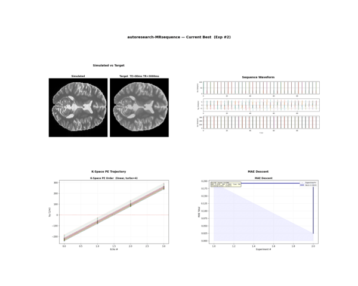
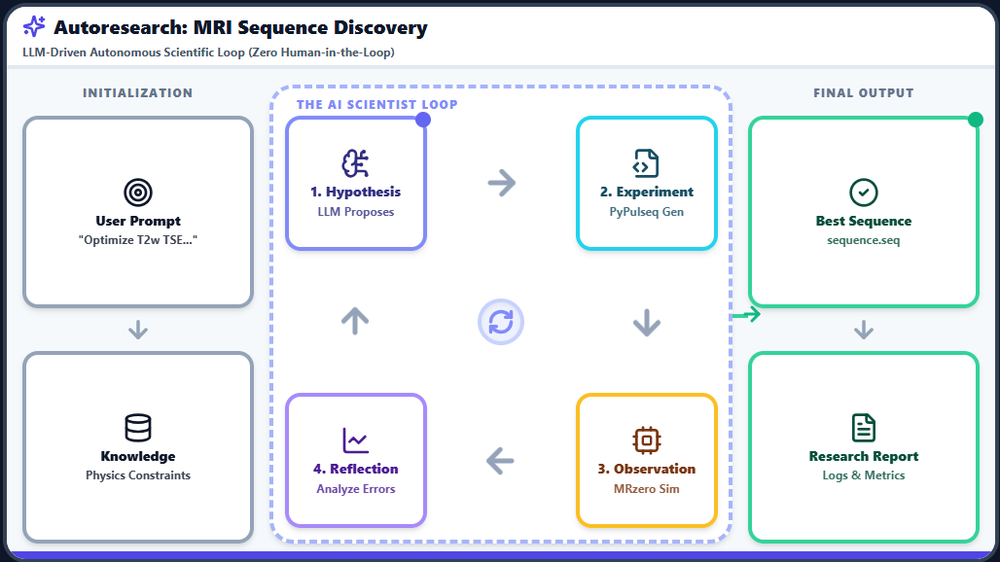
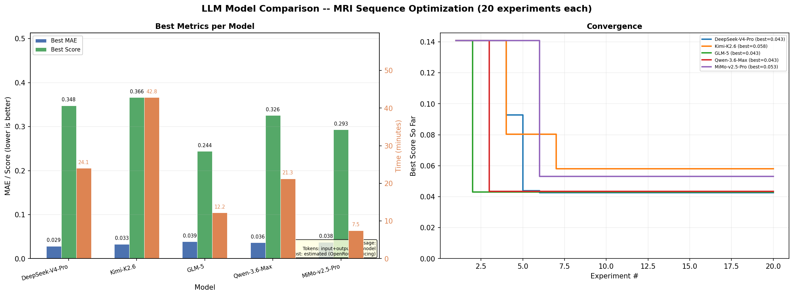

<p align="center">
  
  
  
  <a href="https://arxiv.org/abs/2604.13282"></a>
</p>

<h1 align="center">Autoresearch-MRsequence</h1>

<p align="center"><b>One natural-language instruction to autonomous MRI pulse sequence optimization.</b></p>

<p align="center">
  <i>Transplanting the <a href="https://github.com/karpathy/autoresearch">karpathy/autoresearch</a> LLM-agent paradigm from neural network training to MR physics simulation.<br>
  Built on <a href="https://arxiv.org/abs/2604.13282">Agent4MR (Zaiss et al., 2026)</a>, MRzero-Core, and PyPulseq.</i>
</p>

---

## Overview

Autoresearch-MRsequence turns a high-level MRI sequence request into an iterative design loop. Given one instruction, an LLM agent reads the task protocol, proposes sequence parameters, calls a fixed MR physics evaluator, keeps improvements, and finally writes a scanner-compatible Pulseq file with analysis reports.

The central idea is deliberately simple: the agent may change the sequence parameters, but the evaluation oracle stays fixed. This mirrors the original autoresearch pattern while replacing model training with Bloch-equation simulation and image-quality scoring.

---

## Zero-Config Agent

This repository is designed to work as a drop-in coding-agent workspace. Open it in an AI coding tool and start from a natural-language sequence request.

| Platform | How to use |
|----------|------------|
| **Cursor / Claude Code / Copilot / Aider** | Clone the repo -> open it -> the agent auto-reads `AGENTS.md` -> start talking |
| **ChatGPT Custom GPT** | Import `agent/custom_gpt_config.json` |
| **Claude Project** | Create a Project with `agent/claude_project.md` as knowledge |
| **Any LLM** | Copy `agent/system_prompt.md` as system instructions |

```bash
git clone https://github.com/zjgao-spin/Autoresearch_MRsequence.git
cd Autoresearch_MRsequence
# Open in Cursor / Claude Code / your AI editor.
# The agent automatically reads AGENTS.md.
```

Then ask, for example:

```text
Design a T2w TSE with 128x128 matrix, TE=80ms, TR=3000ms, FOV=0.2m, ST=5mm
```

The agent reads `AGENTS.md`, understands the allowed parameter space, calls `evaluate()`, iterates over candidate designs, and outputs `best_sequence.seq` with reports.

<p align="center">
  <b>Clone → one command → autonomous optimization → scanner-ready sequence</b><br>
  
</p>

> The repository-level agent protocol is `AGENTS.md`, so major AI coding tools can detect the task instructions without manual setup.

---

## What It Does

| Baseline | Autonomous Optimization |
|----------|-------------------------|
| Linear encoding, turbo=8, MAE=0.193 | Centric encoding, turbo=16, MAE=0.051 |
| 180deg refocusing, SAR=0.0053 | Purcell-style VFA, SAR=0.0040 |

> In 10 experiments, the agent reduced MAE by 73% and discovered centric encoding plus variable flip angles without hardcoded physics heuristics.

---

## Architecture

| karpathy/autoresearch | MRI equivalent | Role |
|-----------------------|----------------|------|
| `program.md` | `AGENTS.md` | Task protocol read by the agent |
| `train.py` | `sequences/tse.py` + params dict | Mutable design space controlled by the agent |
| `prepare.py` | `evaluate.py` | Fixed oracle: MRzero Bloch simulation, NUFFT reconstruction, and MAE scoring |

<p align="center">
  
</p>

---

## Output Files

| File | Description |
|------|-------------|
| `best_sequence.seq` | Scanner-compatible Pulseq sequence file for Siemens/GE/Philips workflows |
| `progress.png` | Four-panel optimization summary: score descent, MAE/SAR tradeoff, convergence, and best parameters |
| `sequence_waveform.png` | Gradient, RF, and ADC timing diagram |
| `kspace_view_order.png` | Phase-encoding lines per excitation and order matrix |
| `analysis_report.md` | Full optimization summary |
| `experiment_*.png` | Six-panel comparison for each KEEP event |
| `results.tsv` | Tab-separated log of every experiment |

---

## LLM Model Benchmark

Five models were evaluated on the same task: **20 experiments each** for `T2w TSE, 128x128, TE=80ms, TR=3000ms`. The agent prompt included the full `AGENTS.md` domain protocol, and k-space noise was disabled for a clean comparison.

> **MAE**: mean absolute error between the NUFFT-reconstructed image and the Bloch-theoretical T2-weighted target, computed voxel-wise. Lower is better.

> **Score**: composite objective, `0.5 * MAE/baseline + 0.3 * SAR/baseline + 0.2 * Time/baseline`, where the baseline is experiment #1 with default parameters. Lower is better.

| Rank | Model | Best MAE | Best Score | Time | Tokens In | Tokens Out | Cost |
|------|-------|----------|------------|------|-----------|------------|------|
| 1 | **GLM-5** | 0.0387 | **0.244** | 12.2 min | 46,856 | 12,980 | $0.07 |
| 2 | MiMo-v2.5-Pro | 0.0376 | 0.293 | 7.5 min | 54,920 | 18,408 | $0.07 |
| 3 | Qwen-3.6-Max | 0.0364 | 0.326 | 21.3 min | 51,783 | 40,184 | $0.44 |
| 4 | DeepSeek-V4-Pro | **0.0285** | 0.348 | 24.1 min | 42,478 | 40,412 | $0.83 |
| 5 | Kimi-K2.6 | 0.0329 | 0.366 | 42.8 min | 46,244 | 59,049 | $0.98 |

**Result summary:** GLM-5 achieved the best composite score with fast convergence and low cost. DeepSeek-V4-Pro produced the best image quality by MAE. MiMo-v2.5-Pro was the fastest run and achieved the second-best score.

<p align="center">
  
</p>

To reproduce the benchmark:

```bash
python benchmark/compare_models.py --api-key $OPENROUTER_KEY
```

---

## Quick Start

```bash
pip install -r requirements.txt

# Random explorer, no API key required.
python run.py "Design a T2w TSE with 128x128, TE=80ms, TR=3000ms" -n 50 -o output

# LLM-driven optimization.
python run.py "Design a T2w TSE..." --mode llm --model deepseek/deepseek-v4-pro \
  --api-key $OPENROUTER_KEY -n 20 -o output
```

---


## Example: VSCode Copilot + GLM-5.1

A live optimization session using VSCode Copilot with GLM-5.1 — the agent reads `AGENTS.md`, proposes TSE parameters, iterates via `evaluate()`, and converges to the best sequence autonomously.

<p align="center">
  <a href="https://github.com/zjgao-spin/Autoresearch_MRsequence/releases/download/v1.0/Video.Project.mp4">
    
  </a>
  <br>
  <sub>⬆ Click the image to download/watch the full demo video (21 MB) · <a href="https://github.com/zjgao-spin/Autoresearch_MRsequence/releases/tag/v1.0">Release v1.0</a></sub>
</p>

---

## Built On

| Project | Role |
|---------|------|
| [karpathy/autoresearch](https://github.com/karpathy/autoresearch) | Autonomous agent paradigm |
| [Agent4MR](https://arxiv.org/abs/2604.13282) | Agentic MR development with LLMs |
| [MRzero-Core](https://github.com/MRsources/MRzero-Core) | GPU Bloch equation simulation |
| [PyPulseq 1.4.2](https://pypulseq.readthedocs.io/) | Pulse sequence programming |

## License

MIT - see [LICENSE](LICENSE)
